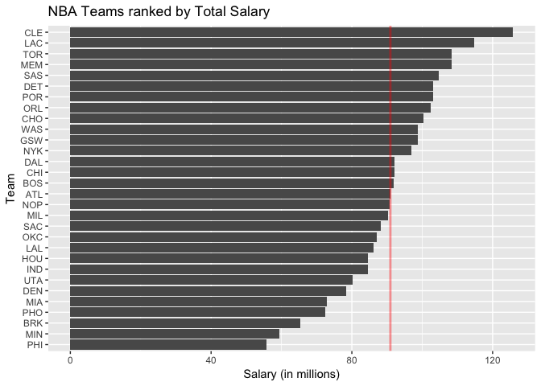
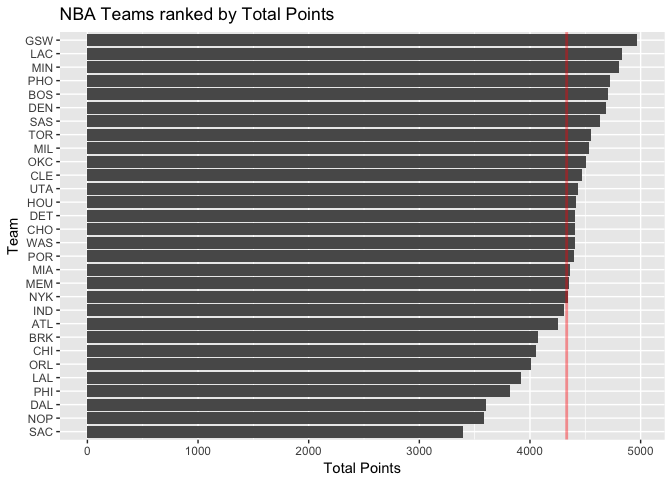
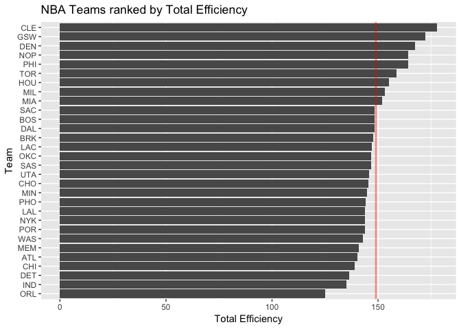
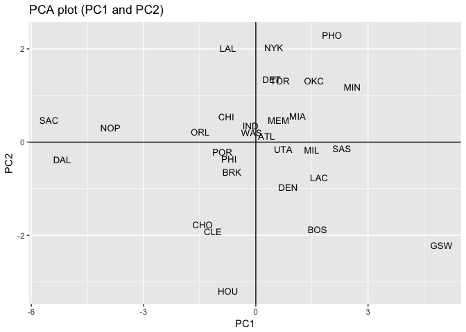
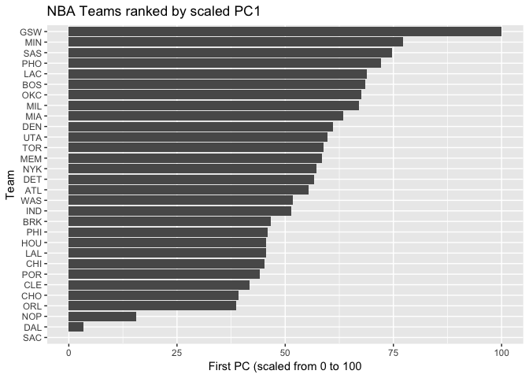

hw03-dominic-tu.rmd
================
Dominic Tu
10/11/2017

Ranking of teams
================

<pre class="knitr r">library(readr)
library(dplyr)
library(ggplot2)
library(knitr)
render_html()
</pre>

Basic Rankings
--------------

<pre class="knitr r">teams
ggplot(teams,
       aes(x = reorder(team, salary),
           y = salary)) +
  geom_bar(stat = &quot;identity&quot;) +
  coord_flip() +
  ggtitle(&quot;NBA Teams ranked by Total Salary&quot;) +
  labs(x = &quot;Team&quot;, y = &quot;Salary (in millions)&quot;) +
  geom_hline(data = teams, aes(yintercept = mean(salary)), color = 'red', alpha = .4, size  = 1)
</pre>

<pre class="knitr r">ggplot(teams,
       aes(x = reorder(team, points),
           y = points)) +
  geom_bar(stat = &quot;identity&quot;) +
  coord_flip() +
  ggtitle(&quot;NBA Teams ranked by Total Points&quot;) +
  labs(x = &quot;Team&quot;, y = &quot;Total Points&quot;) +
  geom_hline(data = teams, aes(yintercept = mean(points)), color = 'red', alpha = .4, size = 1)
</pre>

<pre class="knitr r">ggplot(teams,
       aes(x = reorder(team, efficiency),
           y = efficiency)) +
  geom_bar(stat = &quot;identity&quot;) +
  coord_flip() +
  ggtitle(&quot;NBA Teams ranked by Total Efficiency&quot;) +
  labs(x = &quot;Team&quot;, y = &quot;Total Efficiency&quot;) +
  geom_hline(data = teams, aes(yintercept = mean(efficiency)), color = 'red', alpha = .4, size = 1)
</pre>

PCA
---

<pre class="knitr r">pca = prcomp(select(teams, points3, points2, free_throws,
                    off_rebounds,def_rebounds,  assists, steals,
                    blocks, turnovers, fouls), scale. = TRUE)
eigenvalue = pca$sdev^2
df_eigs = data.frame(eigenvalue,
                     prop = round(eigenvalue/sum(eigenvalue), 4),
                     cumprop = round(cumsum(eigenvalue/10), 4))

ggplot(teams, aes(x = pca$x[ , 1], y = pca$x[ , 2], label = team)) +
  geom_text(size = 3.5) +
  geom_hline(yintercept = 0) +
  geom_vline(xintercept = 0) +
  ggtitle(&quot;PCA plot (PC1 and PC2)&quot;) +
  labs(x = &quot;PC1&quot;, y = &quot;PC2&quot;)
</pre>

<pre class="knitr r">s1 = 100*((pca$x[ ,1] - min(pca$x[ ,1])) / (max(pca$x[ ,1]) - min(pca$x[ ,1])))
teams = mutate(teams, PC1 = s1)
teams

ggplot(teams, aes(x = reorder(team, s1), y = s1)) +
  geom_bar(stat = &quot;identity&quot;) +
  coord_flip() +
  labs(x = &quot;Team&quot;, y = &quot;First PC (scaled from 0 to 100&quot;) +
  ggtitle(&quot;NBA Teams ranked by scaled PC1&quot;)
</pre>

-   The PCA1 ranking shows that the Golden State Warriors show the more variation with (PCA1 = 100), and Sacramento Kings show the least amount of variation with (PCA1 = 0)

------------------------------------------------------------------------

comments and reflection
=======================

> I think the hardest part was learning PCA on our own. It was brand new to me. Relative path was quite easy once you learn how to use it. This assignment took me about 5 hours
